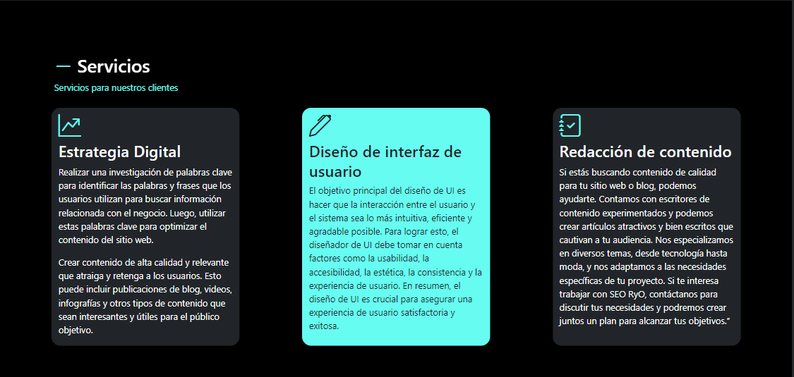
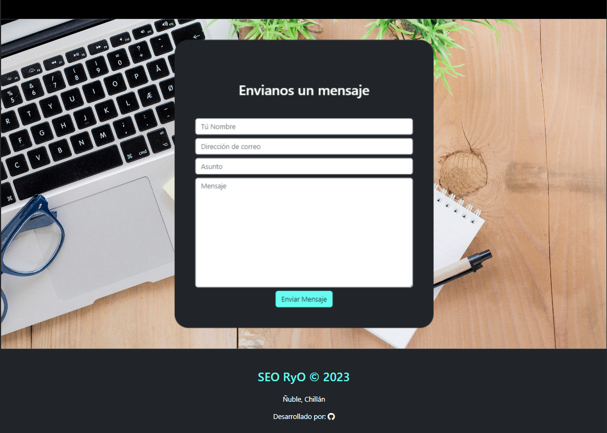

# Proyecto Personal: SEO RyO

### Introducción:
Este proyecto fue realizado con el fin de desarrollar mis habilidades de diseño web, basandome en el UX para una página de SEO.
Proyecto realizado con fines educativos y para el autoaprendizaje.

### Tecnologías:
- HTML
- CSS
- Bootstrap
- [Animate On Scroll Library](https://michalsnik.github.io/aos/ "Animate On Scroll Library") (animación)

### Link:
[SEO RyO](https://ivanbecerraa.github.io/TopSEO/ "SEO RyO")

### Galería

